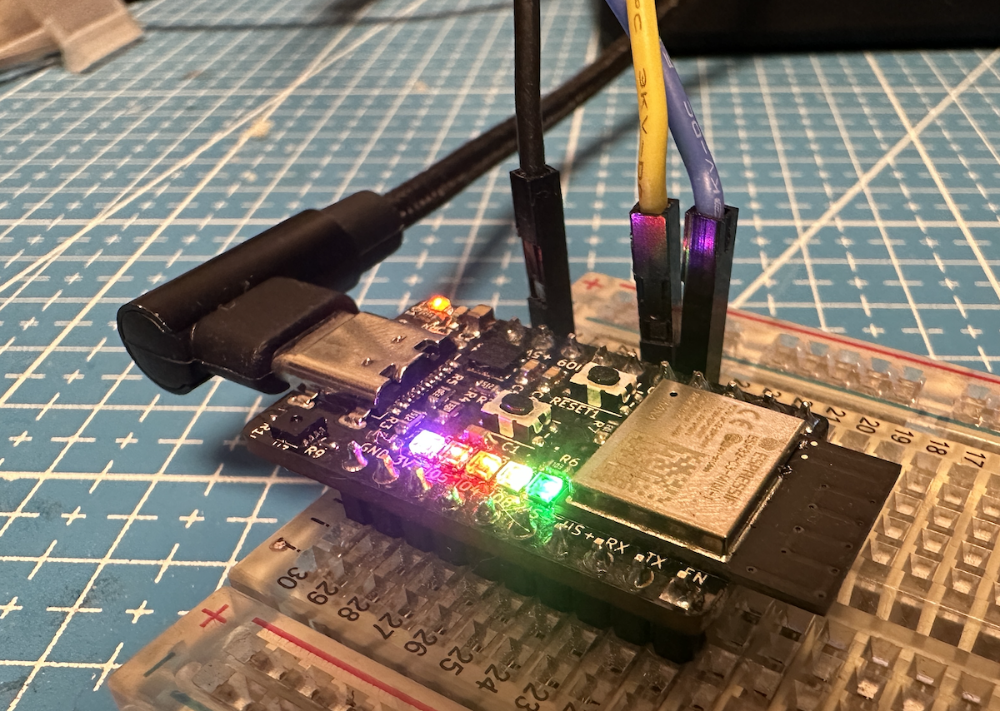
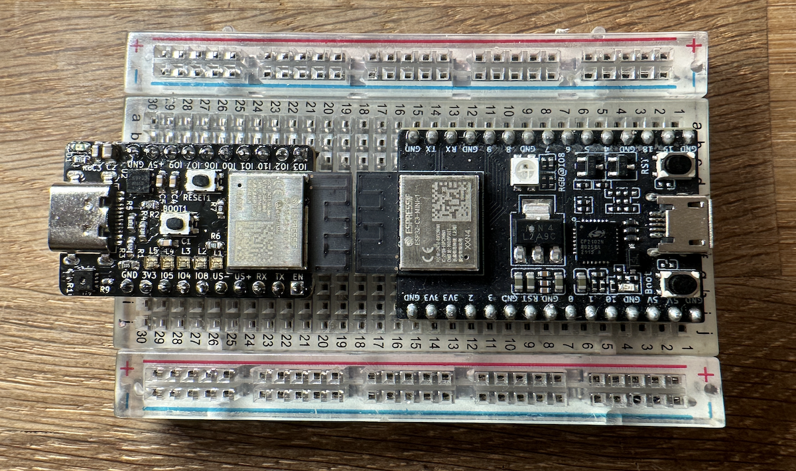
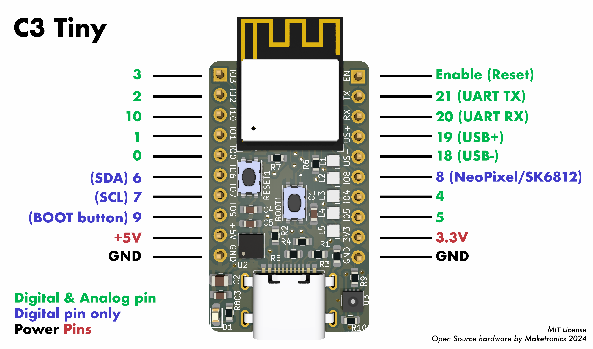

# ESP32 C3-tiny
A Tiny but very functional DevBoard with Temperature/Moisture sensor and 5 programmable LEDs.

## Why smaller?

The official devboard from Espressif is crazy big for such a tiny module? I wanted to make something that leaves two rows on each side when put into a normal half-size breadboard, while testing out the Espressif ESP32 C3 module. Also - I could make this as a christmas gift for my son since he studies electronics and likes RiscV? And then I could publish it as a starting point for others to design their own boards? Why not!

I won't say that the pinout isn't a bit messy (as not in correct order), but all pins are broken out and this project should make it easy for anyone to create their own Espressif C3 based boards. The repository is complete with [Kicad files](pcb/), [BOM](bom/) and [test code for Arduino](code/).

## Pinout

[*] All the module pins are broken out and some pins such as pin 18 + 19 is used for the USB connection. That means that you cannot connect anything to these if you want to use USB.

[*] You also cannot use pins 6 (SDA) and 7 (SCL) for other things if you want to also use the SHT31 sensor connected to these pins (I2C Bus). Other I2C devices shopuld also be connected to these pins. Note that there are pullup resistors on these pins. If you keep this in mind, you can use the pins if you don't use I2C.

[*] The Boot button may be used as an input - after startup has finished.

## Arduino usage

Select "ESP32C3 Dev Module" as the board and set "USB CDC on Boot" to true. The SHT31 sensor is on address 0x44 and you need to start I2C using pins 6 and 7 like this:

`Wire.begin(6,7);`

The five RGB LEDs are connected to pin 8. Check out the code example for details.
